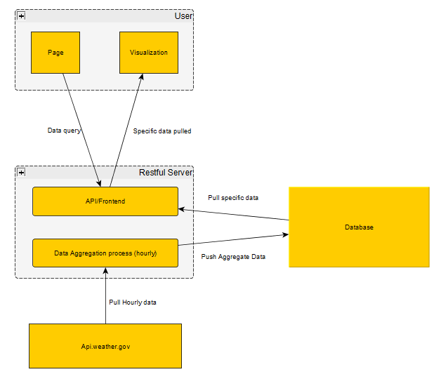

# Project-2: Team ThunderSnow

    Our task in this project was to tell a story through data visualizations that would provide users with an interactive means to explore the data themselves.  In order to accomplish an interactive story, we chose to create a weather dashboard that would analyze and predict the accuracy of the National Weather Service's API for the D.C. area.  We also wanted to challenge ourselves with the task of making this run via a liver server that would take current weather forecast data, compare and analyze it contra past observed weather data, then visualize the findings on a web page which would provide interaction for the users who visit it.  We wanted to do something that would be useful for the area as well as fun and challenging to do. 
 
   
 Here are just some of the tools that we used to accomplish this project:  Google SDK for our server, Python & Flask, Postgres SQL, HTML with Bootstrap, CSS & Javascript, and Leaflet.js, Vega, and D3 for our visualizations. Below are the primary datasets that we worked with: 
National Weather Service API - https://forecast-v3.weather.gov/documentation?redirect=legacy  
Weather for the DMV area - https://www.weather.gov/lwx/  
Copy of the Metadata - https://api.weather.gov/gridpoints/LWX/94,69/forecast/hourly  
Historical Test Weather Data - https://openweathermap.org/api 
  

 Here is a chart laying out how we structured our server for use with Google SDK and Postgres SQL: 

